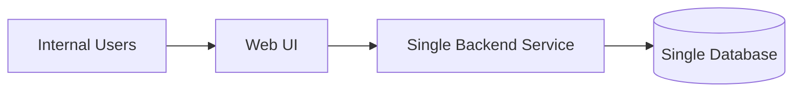

# Product Requirements Document (PRD)

## Product Name (working)

*To be decided*

**Tagline:**
Turn business rules into operational systems

---

## 1. Background & Context

Modern teams run on business rules that are poorly enforced by software.
Processes live across spreadsheets, docs, chat messages, and tribal knowledge. As teams scale, this leads to inconsistency, delays, and accountability gaps.

Existing tools optimize for flexibility or speed, not correctness or trust.

This product exists to make business rules executable, observable, and auditable without requiring custom engineering.

---

## 2. Problem Statement

Companies lack a reliable way to convert business rules into enforceable operational systems.

As a result:

* Rules are inconsistently followed
* States are ambiguous
* Accountability is unclear
* Engineers spend time building non-core internal tools

---

## 3. Goals (What success looks like)

### Primary Goals

* Enable non-engineers to define and enforce workflows
* Ensure every record follows explicit states and rules
* Provide complete explainability for all changes

### Non-Goals (v1)

* No customer-facing apps
* No scripting or custom code
* No payments or financial ledgering
* No AI-driven decisions
* No cross-entity orchestration

(Non-goals are enforced by product design, not documentation.)

---

## 4. Target User

### Primary User

Business Analyst / Operations PM in a 20–200 person company

**Characteristics**

* Owns a process end-to-end
* Accountable for outcomes
* Comfortable with logic, not code
* Frustrated with Excel + Slack workflows

### Secondary Users

* Operators executing tasks
* Managers reviewing compliance and progress

---

## 5. Use Case Scope (v1 Boundary)

### Included

* Single internal workflow
* One primary entity (Lead, Asset, Case, Request)
* Deterministic state transitions
* Rule-based enforcement
* Manual operation (no integrations)

### Excluded

* Multi-entity workflows
* External APIs
* Custom UI layouts
* Public access or sharing

---

## 6. Core Concepts & Definitions

### Entity

The primary record being managed (e.g., Lead)

### State

A mutually exclusive stage in the workflow

### Transition

An allowed movement from one state to another

### Rule

A deterministic condition that enforces or blocks actions

### Action

A system response (state change, assignment, field update)

---

## 6.5 High-Level System Diagram (MVP)

### MVP Tech Stack (Django)

* Backend: Django + Django REST Framework
* Database: Postgres
* Frontend: React + Vite
* Auth/Roles: Django auth + role model
* Rules Engine: In-process deterministic evaluator (Python)

---

## 6.6 Database Design (MVP)

### Core Tables

* `users` (id, name, email, role, created_at, updated_at)
* `workflows` (id, name, is_active, created_at)
* `states` (id, workflow_id, name, order_index, is_initial)
* `transitions` (id, workflow_id, from_state_id, to_state_id, name, order_index)
* `rules` (id, transition_id, name, condition_type, params_json, eval_order)
* `schema_versions` (id, workflow_id, version, created_at)
* `schema_fields` (id, schema_version_id, name, field_type, required, options_json)
* `entities` (id, workflow_id, current_state_id, schema_version_id, data_json, created_by, created_at, updated_at)
* `audit_log` (id, entity_id, actor_id, action_type, from_state_id, to_state_id, rule_id, reason, created_at, metadata_json)

### Key Notes

* `entities.data_json` stores field values for the current schema version.
* `rules.condition_type` is an enum-like string with a fixed allowlist.
* All writes to `entities` are accompanied by an `audit_log` row.
* MVP assumes a single workflow and entity type, but the model supports expansion.

### Minimal Indexes

* `entities(current_state_id)`
* `audit_log(entity_id, created_at)`
* `transitions(from_state_id, to_state_id)`
* `rules(transition_id, eval_order)`

---

## 7. Functional Requirements

### 7.1 Data Modeling

* Create primary entity with typed fields
* Enforce required fields
* Schema versioning

### 7.2 State Management

* Explicit state definitions
* Records must always be in exactly one state
* Controlled state transitions only

### 7.3 Rules Engine

* If–then rules tied to transitions
* Selectable conditions (no free text)
* Deterministic evaluation order
* Conflict detection

### 7.4 Views

* Table view (filterable)
* Kanban view by state
* Record detail view with history

### 7.5 Audit & Explainability

* Log all changes
* Show rule or user responsible
* Reason for blocked actions

### 7.6 Access Control

* Internal users only
* Roles: Admin, Operator, Viewer
* Role-based permissions

---

## 8. User Stories (High-level)

(Refer to detailed user stories document)

* Define workflow structure
* Enforce rules automatically
* Operate daily work via states
* Understand why changes happened
* Modify rules safely over time

---

## 9. UX Principles

* Clarity over flexibility
* Predictability over customization
* Constraints are explicit
* No hidden behavior
* Every system action must be explainable

---

## 10. Success Metrics

### Qualitative

* Users trust the system over chat messages
* Fewer “what happens next?” questions
* Reduced manual follow-ups

### Quantitative

* % of actions blocked/enforced by rules
* Time to define first workflow
* Number of rule-driven transitions

---

## 11. Risks & Open Questions

### Risks

* Over-constraining early users
* Rule complexity creep
* Desire for scripting or integrations

### Open Questions

* How much override power is allowed?
* Should rules apply retroactively?
* How are schema changes migrated?

---

## 12. Future Considerations (Post v1)

(Not commitments)

* Webhooks & notifications
* Read-only external access
* AI-assisted rule suggestions
* Multi-entity workflows

---

## 13. Out of Scope

Anything not listed above is explicitly out of scope for v1.

---

### Final note

This PRD should feel restrictive.
That restriction is the product.

If you want next, we can:

* Turn this into a **tech architecture**
* Write a **one-page pitch** using this PRD
* Or simulate a **real v1 workflow end-to-end**
