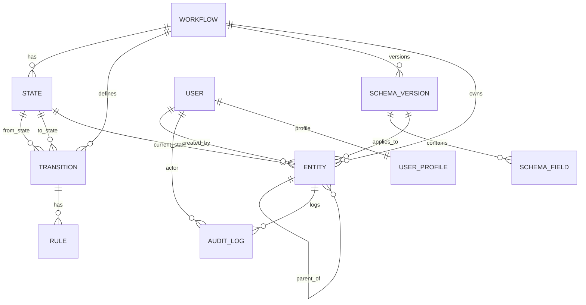

# ER Diagram

```mermaid
erDiagram
  WORKFLOW ||--o{ STATE : has
  WORKFLOW ||--o{ TRANSITION : defines
  WORKFLOW ||--o{ SCHEMA_VERSION : versions
  WORKFLOW ||--o{ ENTITY : owns

  STATE ||--o{ TRANSITION : from_state
  STATE ||--o{ TRANSITION : to_state
  STATE ||--o{ ENTITY : current_state

  TRANSITION ||--o{ RULE : has

  SCHEMA_VERSION ||--o{ SCHEMA_FIELD : contains
  SCHEMA_VERSION ||--o{ ENTITY : applies_to

  ENTITY ||--o{ ENTITY : parent_of
  ENTITY ||--o{ AUDIT_LOG : logs

  USER ||--o{ ENTITY : created_by
  USER ||--o{ AUDIT_LOG : actor
  USER ||--|| USER_PROFILE : profile
```
